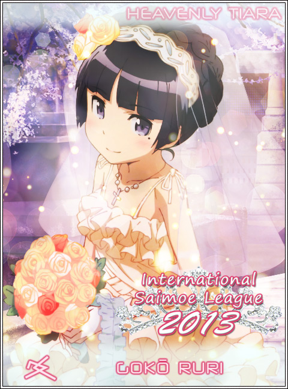
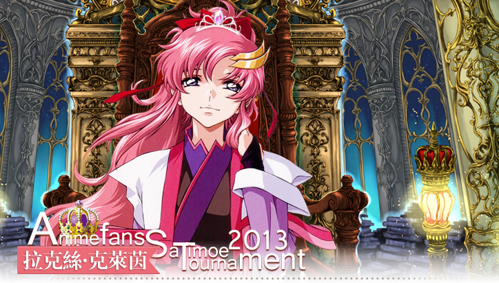
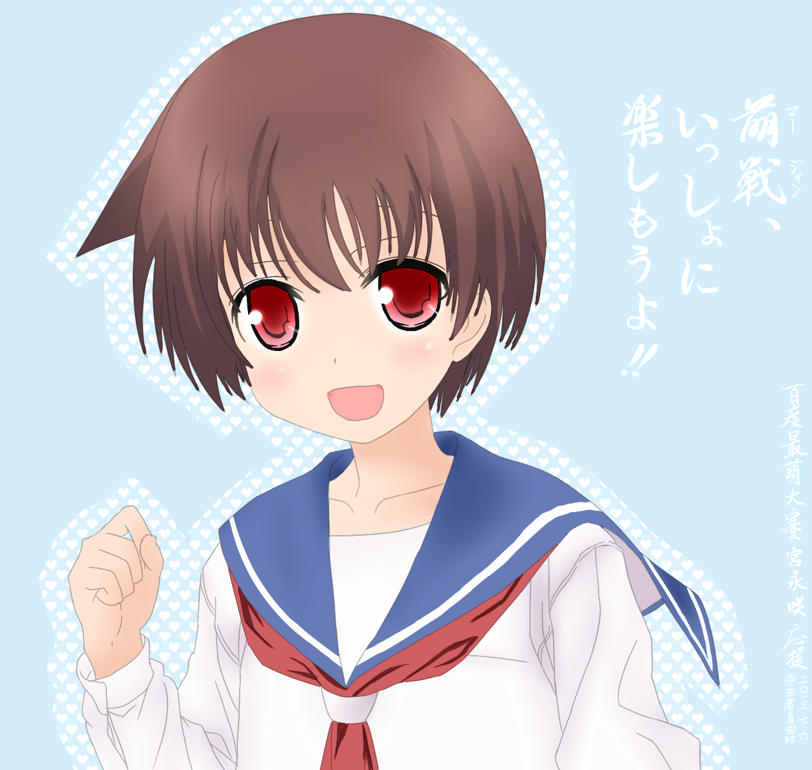

# 萌战

萌战源于日本，正如ACG文化源于日本一样。所谓萌战，就是日本动画最萌大赛，是各类萌战的起源。直至今天，提起“萌战”我们主要指的是日萌。然而后期出现的“韩萌”“中萌”乃至“世萌”各有特色，也属于萌战。

## 日萌（アニメ最萌トーナメント）

日萌2013官网（日语）：(http://acst13.saimoe.me/)

日萌2002年起源于2ch叶键版（类似于百度贴吧），首届萌王是**木之本樱**＠*魔卡少女樱*。投票方式为code制，领取code之后回复帖子，可以实时看到别人的投票，随时掌握比赛进程。所以每次比赛都会有大量人观战，主要的观战场是百度萌战吧的直播楼。

日萌的赛制简单粗暴，进行速度快，比赛激烈，是其受人关注的原因之一。萌战的看点其一在于“萌”，角色的萌度决定了其战斗力，使得无数宅男竞折腰；其二在于“战”，投票者大多结成联盟，称为“阵营”，为了自己的目的无所不用其极，伪票、隐票、多重票战术使得赛场硝烟四起，激烈程度不亚于一场世界战争，令人着迷。

虽然当初有《最萌三原则》，但是由于萌战的形式导致了阵营和“厨”的出现，这些原则似乎只是笑柄了。有人说，“萌战”即“厨战”，一点不假。然而毕竟有如此多的人醉心于此，也正是这种勾心斗角、争斗厮杀的魅力所在。即使身在海外（相对于日本而言，也就是说中国就是海外）不能投票，也乐于看着大厨们你争我抢的精彩战斗。

#### ★最萌三原则

1. 萌有千差万别，各人都有自己的萌
2. 不能因为自己的萌而去刻意否认他人的萌
3. 赌上荣耀，为自己的萌投上干净的一票

### 历代萌王和准萌

1. 2002年 木之本樱（魔卡少女樱） 春日步（阿兹漫画大王）
2. 2003年 原田梨红（天使怪盗） 原素子（高机动幻想 GPM）
3. 2004年 罗兹玛莉（明日的娜嘉） 娜嘉（明日的娜嘉） 
4. 2005年 高町奈叶（魔法少女奈叶） 苍星石（蔷薇少女）
5. 2006年 翠星石（蔷薇少女 梦见） 菲特·泰斯特罗莎（魔法少女奈叶 A's）
6. 2007年 古手梨花（寒蝉鸣泣之时） 三千院凪（旋风管家）
7. 2008年 柊镜（幸运星） 柊司（幸运星）
8. 2009年 逢坂大河（龙与虎） 平泽唯（轻音少女）
9. 2010年 中野梓（轻音少女2） 三千院凪（旋风管家2）
10. 2011年 巴麻美（魔法少女小圆） 佐仓杏子（魔法少女小圆）
11. 2012年 园城寺怜（天才麻将少女 阿知贺篇） 松实玄（天才麻将少女 阿知贺篇）
12. 2013年 鹿目圆（剧场版 魔法少女小圆） 美树沙耶香（剧场版 魔法少女小圆）

## 世萌（International Saimoe League）

世萌官网（英语）：(http://www.internationalsaimoe.com/)

国际最萌大会（简称：世萌；英文：International Saimoe League，ISML)，为Minhtam创办的国际性萌战，每年举办一次。2008年，首届国际最萌大会冠军为**菲特·泰斯特罗莎·哈拉温**＠*魔法少女奈叶*。2013年，第六届国际最萌大会冠军为**五更琉璃**＠*我的妹妹不可能这么可爱*，亚军是**天使（立华奏）**＠*Angle Beats!*。

世萌比赛途中无法看到实际战况，故不存在伪票之说。多重票也会在比赛后由运营裁决去除。相比日萌而言，世萌没有厨战，相对比较无聊。但是由于参赛人数多，投票面积广，世界各地的人都能投票，似乎比日萌更为知名。

## 其他萌战

电玩巴士在2007年举办首届《中国最萌大会》，由于某些原因只开办了三届，死于2009年。

《动漫FANS最萌》，简称“DM萌”，开办于动漫FANS论坛，自中萌停办以来是目前国内规模最大最具代表性的萌战活动之一，始于2008开始。今年萌王是**拉克丝·克莱茵**＠*机动战士高达seed 重置版*，亚军**小鸟游六花**＠*中二病也要谈恋爱！*。

《百合会最萌世界杯》，又称“300萌”，自2006年开始，每年于百合会论坛举办的活动。2013年的比赛目前正在举行中……

2010年开始，百度贴吧（主要是萌战吧，赛场在最萌大赛吧）自发组织最萌比赛，又称“度萌”。今年2013年的优胜是**宫永咲**＠*天才麻将少女阿知贺篇 episode of side-A*，准优胜是**小鸟游六花**＠*中二病也要谈恋爱*。

PS: 小编为了度萌决赛还专门画了这张应援图，从此成为了我的新头像。度萌无官方图，就用这张代替了。

另外还有百度世萌吧举办的“新星萌”、萌战吧年初举办的“best歌赏”、“最萌战队联赛”等。

## 燃战

萌战的角色都是女性，显然是男性向的。而女性向的燃战也应运而生。在日语中，“萌”“燃”同音{もえ(moe)}，

今年的度燃燃王是**不二周助**＠*网球王子*。日燃仍无结果，世燃（世萌表演赛）也正在进行中……